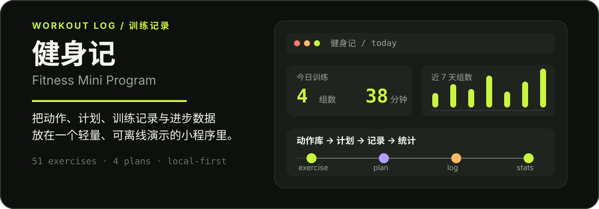

<p align="center">
  
</p>

<p align="center">
  <strong>一个轻量、可离线演示、支持微信云开发的健身训练记录小程序。</strong><br>
  <sub>A lightweight WeChat Mini Program for discovering exercises, applying plans, logging workouts, and tracking progress.</sub>
</p>

<p align="center">
  <a href="#中文">中文</a> · <a href="#english">English</a>
</p>

## 中文

### 它解决什么问题

「健身记」把一次训练需要的几件事放在同一条流程里：

**浏览动作 → 选择训练计划 → 填入今日训练 → 查看日历与统计**

项目默认不依赖后端即可在微信开发者工具中演示；配置微信云开发后，训练记录和动作标注可以按用户存入云数据库。

### 功能概览

| 模块 | 能做什么 |
| --- | --- |
| 动作库 | 浏览 51 个动作，按部位筛选，搜索肌群/器械，查看步骤与 GIF 演示 |
| 训练计划 | 浏览 4 个计划模板，查看完整课表，一键应用为我的方案（云端模式跨设备同步） |
| 每日记录 | 按日期添加动作、组数、次数、重量、时长和备注 |
| 日历 | 查看月度训练标记和某天的训练详情 |
| 统计 | 查看本周/本月训练天数、组数、次数、时长和部位分布 |
| 动作标注 | 在动作详情页保存个人发力要点、动作感受和注意事项 |
| 外观 | 支持浅色、深色和跟随系统三种主题 |

### 快速开始

1. 安装并打开[微信开发者工具](https://developers.weixin.qq.com/miniprogram/dev/devtools/download.html)。
2. 导入本仓库根目录。
3. 复制 `project.private.config.example.json` 为 `project.private.config.json`，并只在后者填写自己的小程序 AppID。该本地文件已被 Git 忽略，不能提交。
4. 在开发者工具中编译 `miniprogram/`。

未配置云环境时，项目会使用本地存储完成完整演示：

```text
miniprogram/env.js
CLOUD_ENV: ''
```

### 配置云开发

如果需要跨设备保存数据：

1. 在微信开发者工具中开通云开发并创建环境。
2. 把环境 ID 写入 `miniprogram/env.js` 的 `CLOUD_ENV`。
3. 创建 `users`、`records`、`notes` 三个云数据库集合，权限设为“仅创建者可读写”。
4. 创建联合索引：`records` 使用 `(_openid, date, createdAt)`；`notes` 使用 `(_openid, exId, createdAt)` 和 `(_openid, createdAt)`。
5. 分别部署 `cloudfunctions/login`、`cloudfunctions/records`、`cloudfunctions/notes`、`cloudfunctions/user`。

云端请求或静默登录失败时，应用会明确提示错误，不会把写入操作偷偷切换到本地，避免产生两份不一致的数据。训练日期统一按中国标准时间处理。

### 项目结构

```text
.
├── miniprogram/
│   ├── pages/                 # 动作库、计划、记录、日历、统计
│   ├── packageDetail/         # 动作详情分包与 GIF 演示
│   ├── components/            # 动作项、选择器、记录表单等
│   ├── services/              # 数据访问、记录、标注、计划、主题
│   ├── data/                  # 51 个动作与 4 个训练计划
│   └── utils/                 # 日期、主题包装、数据校验与错误提示
├── cloudfunctions/            # login / records / notes
├── project.private.config.example.json # 本地 AppID 配置模板
├── assets/readme/             # README 视觉资产
├── ARCHITECTURE.md            # 架构与云函数接口说明
└── DESIGN.md                  # Volt Gym 视觉设计系统
```

### 技术特点

- **本地优先**：未配置云环境也能运行和演示。
- **数据边界清晰**：页面状态、全局会话状态和持久化数据分层管理。
- **小程序原生能力**：使用分包、预下载、云函数和云数据库。
- **服务层复用**：页面不直接依赖云函数协议，记录与标注通过统一 service 访问。
- **输入安全**：客户端和云函数双重校验日期、数值、文本长度和用户数据归属；数值限制由 `shared/validation.js` 单一事实源生成，两端不会漂移。
- **完整聚合**：记录与标注会分页读取；统计不会因单页上限而静默漏算。
- **原子填入**：训练计划在本地模式一次写入，在云端模式使用事务写入，避免半套计划残留。

### 开发校验

项目不依赖额外测试框架；可使用 Node 20+ 运行静态校验与回归测试：

```bash
npm run verify
```

GitHub Actions 会在推送和 Pull Request 时运行相同校验。

### 当前边界

- 动作库和训练计划是随版本发布的静态数据，不支持在线编辑。
- 统计目前由前端聚合周期内记录，适合 MVP 阶段的个人数据量。
- `CLOUD_ENV` 默认为空；生产使用前需要配置自己的 AppID、云环境和数据库集合。
- AppID 仅保存在被忽略的 `project.private.config.json`；真正敏感的 AppSecret、访问令牌和私钥绝不能放入仓库或小程序前端。
- 已有本地数据不会自动迁移到后来配置的云环境；发布迁移功能前，应先提供用户确认、备份与导入流程。
- 仓库未附带可直接提交的隐私协议与审核材料。请按实际运营主体、联系方式、用途、留存期限和用户权利补充，不能默认声明“无收集”。

### 相关文档

- [架构方案](./ARCHITECTURE.md)
- [Volt Gym 设计系统](./DESIGN.md)
- [微信小程序开发文档](https://developers.weixin.qq.com/miniprogram/dev/framework/)

## English

### What it does

**Fitness Mini Program** keeps the core workout loop in one place:

**Browse exercises → choose a plan → fill today’s workout → review calendar and stats**

It runs in a local-storage demo mode by default, so the project can be explored without a backend. Once WeChat Cloud Development is configured, workout records and exercise notes can be stored per user in the cloud database.

### Features

| Module | What it provides |
| --- | --- |
| Exercise library | 51 exercises, body-part filters, keyword search, step-by-step guidance, and GIF demos |
| Training plans | 4 plan templates, full routines, and one-tap application (synced across devices in cloud mode) |
| Daily logging | Date, sets, reps, weight, duration, and notes |
| Calendar | Monthly workout markers and day-level details |
| Statistics | Weekly/monthly days, sets, reps, duration, and body-part distribution |
| Exercise notes | Personal cues, sensations, and reminders attached to an exercise |
| Appearance | Light, dark, and system-following themes |

### Quick start

1. Install [WeChat DevTools](https://developers.weixin.qq.com/miniprogram/en/dev/devtools/download.html).
2. Import the repository root.
3. Copy `project.private.config.example.json` to `project.private.config.json` and put your Mini Program AppID only in the private file. It is Git-ignored and must not be committed.
4. Compile `miniprogram/` in DevTools.

Without a cloud environment, the complete flow runs on local storage:

```text
miniprogram/env.js
CLOUD_ENV: ''
```

### Enable Cloud Development

To persist data across devices:

1. Enable Cloud Development and create an environment in WeChat DevTools.
2. Set the environment ID as `CLOUD_ENV` in `miniprogram/env.js`.
3. Create `users`, `records`, and `notes` collections with creator-only read/write permissions.
4. Create composite indexes: `(_openid, date, createdAt)` for `records`; `(_openid, exId, createdAt)` and `(_openid, createdAt)` for `notes`.
5. Deploy `cloudfunctions/login`, `cloudfunctions/records`, `cloudfunctions/notes`, and `cloudfunctions/user`.

Cloud request and silent-login failures are surfaced to the user instead of silently switching a write to local storage. This prevents two divergent copies of the same data. Training dates use China Standard Time consistently.

### Repository layout

```text
.
├── miniprogram/
│   ├── pages/                 # Library, plans, log, calendar, and stats
│   ├── packageDetail/         # Detail subpackage and GIF demonstrations
│   ├── components/            # Exercise items, picker, record form, and more
│   ├── services/              # Cloud access, records, notes, plans, and themes
│   ├── data/                  # 51 exercises and 4 training plans
│   └── utils/                 # Dates, theme wrapper, validation, and notifications
├── cloudfunctions/            # login / records / notes / user
├── project.private.config.example.json # Local AppID template
├── assets/readme/             # README visual assets
├── ARCHITECTURE.md            # Architecture and cloud API notes
└── DESIGN.md                  # Volt Gym visual design system
```

### Engineering notes

- **Local-first**: the app remains demonstrable without a cloud backend.
- **Clear data boundaries**: page state, shared session state, and persisted data are separated.
- **Native Mini Program capabilities**: subpackages, preloading, cloud functions, and cloud database.
- **Reusable service layer**: pages consume stable services instead of calling cloud functions directly.
- **Input safety**: dates, numeric fields, text length, and user ownership are validated on both client and server; numeric limits come from a single `shared/validation.js` source of truth so the two sides cannot drift.
- **Complete aggregation**: records and notes are paginated so statistics do not silently omit data after a single-page limit.
- **Atomic plan fills**: plan days are written once in local mode and transactionally in cloud mode, preventing partial routines.

### Development checks

The repository uses Node 20+ built-ins only for static checks and regression tests:

```bash
npm run verify
```

GitHub Actions runs the same command on pushes and pull requests.

### Current boundaries

- The exercise library and training plans are static release data; they are not editable online.
- Statistics are currently aggregated on the client, which is appropriate for MVP-scale personal data.
- `CLOUD_ENV` is empty by default; production use requires your own AppID, cloud environment, and collections.
- Keep the AppID only in Git-ignored `project.private.config.json`. Never put a real AppSecret, access token, or private key in the repository or Mini Program client.
- Existing local data is not automatically migrated when cloud mode is enabled later. A migration feature needs explicit consent, backup, and import support.
- A submission-ready privacy policy and review materials are not included. Complete them with the real operator, contact, purpose, retention, and user-rights details; do not default to a “no collection” claim.

### Documentation

- [Architecture](./ARCHITECTURE.md)
- [Volt Gym design system](./DESIGN.md)
- [WeChat Mini Program documentation](https://developers.weixin.qq.com/miniprogram/en/dev/framework/)

### License

No license file has been included yet. Add a license before distributing the project as a reusable open-source package.
